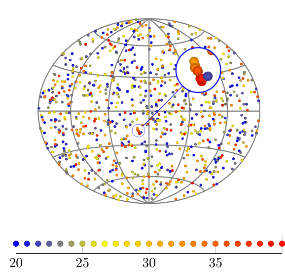

## Spherical Wavelets Analysis Tool (SWAT)

SWAT was developed to test the main ideas of my Ph.D. project,
which was related to recognition of patterns on spherical images
using spherical wavelets.

It has been successfully used to analyse data collected by the
Pierre Auger Observatory. The most important ideas that resulted
from my work were published in the journal "Astroparticle
Physics"

http://www.sciencedirect.com/science/article/pii/S092765051300159X

To give the reader an idea of what SWAT is about, in the figure
below we see a simulated image of the sky. Think the dots as
stars and the their color as the light intensity.  The stars are
randomly sampled in the sky except for the tiny linear structure
depicted in the circle. The algorithm I have developed is used to
find these tiny linear structures.

,

I will upload some more figures from real data. They are very
interesting!!

